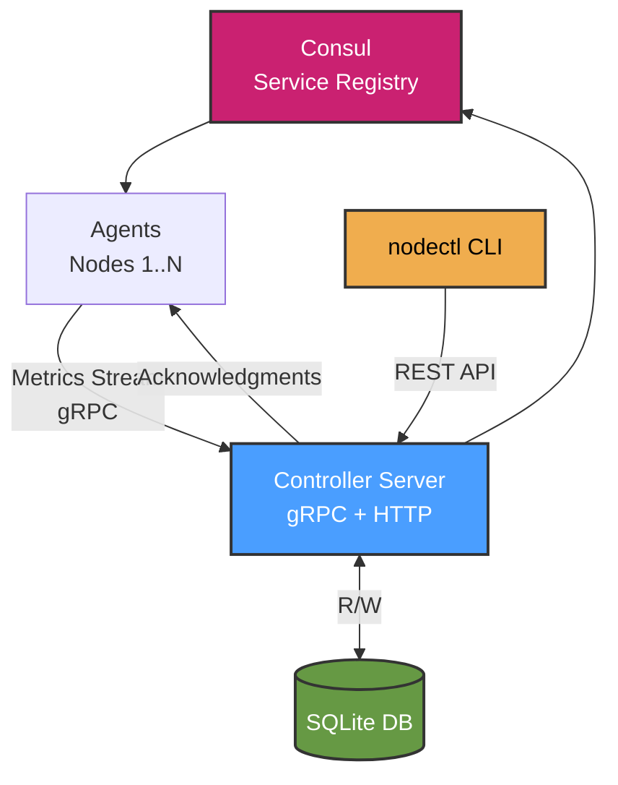

# Sentinel

A lightweight system for collecting and querying host metrics across a distributed fleet. Think of it as a simple monitoring solution where agents report system metrics to a central controller that you can query via CLI, API, or web UI.

## Features

- **Metrics Collection** - CPU, memory, disk, and uptime monitoring
- **Web Dashboard** - Interactive UI with real-time metrics and historical charts
- **Node Tagging** - Organize nodes with tags for better fleet management
- **HTTP API** - RESTful API for querying metrics and host information
- **Service Discovery** - Automatic controller discovery via Consul (optional)
- **SQLite Storage** - Lightweight embedded database with automatic cleanup

## Components

**controller** - Central server that receives metrics from agents and stores them in SQLite. Provides HTTP endpoints for querying host information and a web UI for visualization.

**agent** - Agent that runs on each node to collect and stream system metrics to the controller.

**nodectl** - Command-line tool to interact with the controller API. Query health status, list hosts, view usage stats.

## Quick Start

### Option 1: Direct Connection (Simple)

Run the controller:

```bash
docker run -d -p 8080:8080 -p 9090:9090 \
  ghcr.io/metorial/sentinel-controller:latest
```

Deploy agent agents on your nodes:

```bash
docker run -d \
  -e COLLECTOR_URL=controller.example.com:9090 \
  ghcr.io/metorial/sentinel-agent:latest
```

### Option 2: Consul Service Discovery

Run the controller with Consul registration:

```bash
docker run -d -p 8080:8080 -p 9090:9090 \
  -e CONSUL_HTTP_ADDR=consul.example.com:8500 \
  ghcr.io/metorial/sentinel-controller:latest
```

Deploy agent agents:

```bash
docker run -d \
  -e CONSUL_HTTP_ADDR=consul.example.com:8500 \
  ghcr.io/metorial/sentinel-agent:latest
```

**Note:** Either `COLLECTOR_URL` or `CONSUL_HTTP_ADDR` must be set for agents. `COLLECTOR_URL` takes precedence if both are set.

## Using the CLI

Query metrics and cluster information:

```bash
# Check controller health
nodectl --server http://controller:8080 health

# List all hosts
nodectl --server http://controller:8080 hosts list

# Get detailed host info with tags
nodectl --server http://controller:8080 hosts get my-hostname

# View cluster statistics
nodectl --server http://controller:8080 stats
```

You can set `NODECTL_SERVER_URL` environment variable to avoid passing `--server` every time.

## Web Dashboard

Access the web UI at `http://controller:8080/` to view:

- **Cluster Overview** - Total nodes, online/offline counts, average CPU usage
- **Node List** - Real-time status of all hosts with current resource usage
- **Historical Charts** - Click any host to view CPU, memory, and storage usage over time
- **Auto-refresh** - Dashboard updates every 5 seconds

The UI features a dark HashiCorp-inspired theme with purple accents and is embedded directly in the controller binary.

## Service Discovery with Consul

Sentinel integrates with Consul for automatic service discovery and health checking.

### How It Works

1. **Collector Registration**: When started with `CONSUL_HTTP_ADDR`, the controller registers itself with Consul:
   - Service name: `sentinel-controller` (gRPC on port 9090)
   - HTTP API: `sentinel-controller-http` (REST on port 8080)
   - Health checks on both endpoints

2. **agent Discovery**: agents query Consul for the `sentinel-controller` service
   - Automatic reconnection if controller address changes
   - Polling interval: 10 seconds

3. **Benefits**:
   - No hardcoded controller addresses
   - Automatic failover if controller moves
   - Built-in health monitoring
   - Works in dynamic environments (Kubernetes, cloud platforms)

### Environment Variables

**Collector:**
- `PORT` - gRPC port (default: 9090)
- `HTTP_PORT` - HTTP API port (default: 8080)
- `DB_PATH` - SQLite database path (default: /data/metrics.db)
- `CONSUL_HTTP_ADDR` - Consul address for registration (optional)

**agent:**
- `COLLECTOR_URL` - Direct controller address (e.g., `controller:9090`)
- `CONSUL_HTTP_ADDR` - Consul address for service discovery
- **Note:** Either `COLLECTOR_URL` or `CONSUL_HTTP_ADDR` must be set

## Architecture



## License

Licensed under Apache License 2.0. See [LICENSE](LICENSE) file for details.
